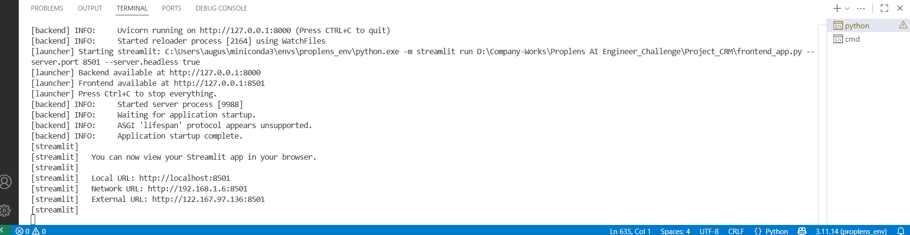
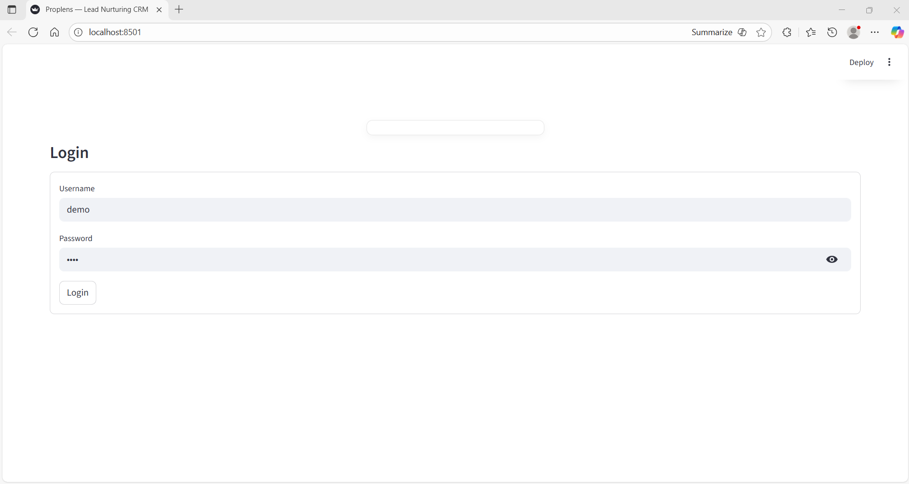
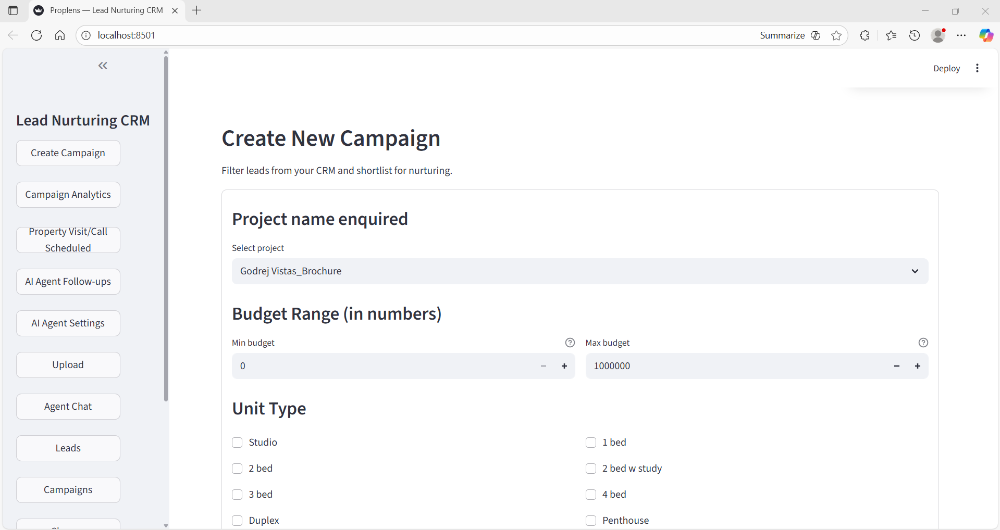
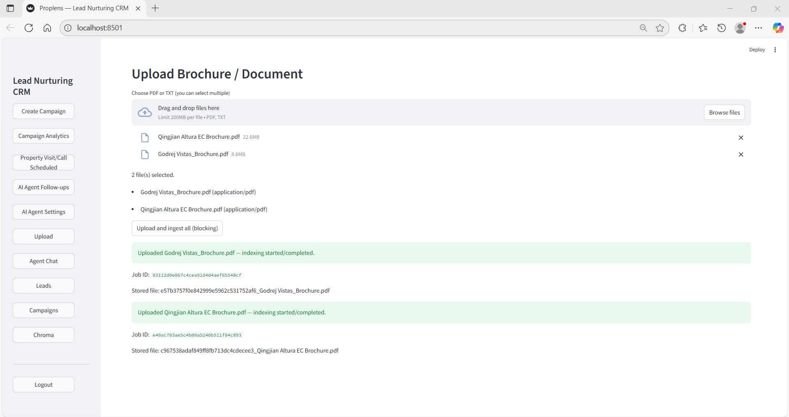

# Proplens — Lead Nurturing CRM (RAG + T2SQL + Chroma indexing + Streamlit UI)

## Summary

This repository implements a simple lead-nurturing CRM prototype that demonstrates:

* Document ingestion (PDF/TXT brochures) → chunking → embeddings → Chroma vector DB.
* A retrieval-augmented generator (Doc RAG node) that queries Chroma and synthesizes short answers.
* A small natural-language-to-SQL node (T2SQL) backed by a mock `VannaWrapper` and a SQLite DB for read-only analytics.
* An HTTP API (Django + Ninja or standalone Ninja) serving endpoints for auth, ingestion, agent queries, probes, leads, and campaign analytics.
* A Streamlit frontend for browsing projects, uploading brochures, interacting with the agent, and composing campaigns.
* Utilities to index uploads, seed the DB, probe Chroma, and run the full app with `main.py`.

Key components:

* `app/langgraph_nodes/` — LangRouter, DocRAGNode, T2SQL node.
* `app/chroma/` — thin Chroma client wrapper and indexer.
* `app/api/` — Ninja routers for auth, ingestion, agent, probe, leads, campaigns.
* `frontend_app.py` — Streamlit UI.
* `index_uploads.py` / `index_chunked_and_embed.py` / `index_all` — local indexing utilities.
* `main.py` — launcher that seeds DB, indexes, and runs backend + frontend.

## Prerequisites

* Python 3.10+ (3.11 recommended)
* pip or conda
* (Optional but recommended) A dedicated virtual environment (conda or venv)
* Sufficient disk space for embeddings and `chroma_data/`
* Network access for downloading SentenceTransformers model the first time
* On Windows: Visual C++ build tools (if compiling wheels)
* On macOS/Linux: typical system build tools for some binary Python dependencies

Files referenced:

* `requirements.txt` and `environment.yml` show the main dependencies.

---

## Installation on Platform-specific steps

> Here are platform-specific shell examples to set up environment and run basic commands.

### 1. PowerShell (Windows)

```powershell
# Clone repo
git clone <repo-url> proplens
cd proplens

# Option A: conda (recommended)
conda env create -f environment.yml
conda activate proplens_env

# Option B: python venv
python -m venv .venv
& ".\.venv\Scripts\Activate.ps1"

# Install extra pip packages (if using venv)
pip install --upgrade pip
pip install -r requirements.txt

# Set environment variables for server run (PowerShell)
$env:DJANGO_SECRET="dev-secret"
$env:JWT_SECRET="supersecret"
$env:DJANGO_SETTINGS_MODULE="app.settings"
```

### 2. CMD (Windows Command Prompt)

```cmd
cd \path\to\proplens

:: create & activate conda env
conda env create -f environment.yml
conda activate proplens_env

:: OR with venv (cmd)
python -m venv .venv
.\.venv\Scripts\activate.bat

:: install packages (if using venv)
pip install --upgrade pip
pip install -r requirements.txt

:: set environment variables (for this cmd session)
set DJANGO_SETTINGS_MODULE=app.settings
set DJANGO_SECRET=dev-secret
set JWT_SECRET=supersecret
```

### 3. Linux / macOS (bash/zsh)

```bash
cd ~/projects/proplens

# Conda
conda env create -f environment.yml
conda activate proplens_env

# OR venv
python3 -m venv .venv
source .venv/bin/activate

pip install --upgrade pip
pip install -r requirements.txt

# export env vars
export DJANGO_SETTINGS_MODULE=app.settings
export DJANGO_SECRET=dev-secret
export JWT_SECRET=supersecret
```
## Installation Packages

> Two styles shown: `Conda` and `venv` are covered in this sections.

### Using conda (optional)

Recommended if you have conda installed.

1. Create environment:

```bash
conda env create -f environment.yml
```

2. Activate:

```bash
conda activate proplens_env
```

3. If adding pip-only packages (listed under `pip:` in `environment.yml`) they will be installed automatically by conda; otherwise, install with pip:

```bash
pip install -r requirements.txt
```

**Notes:**

* Conda often handles compiled binary dependencies better on Windows/macOS.
* If you hit version conflicts, try adjusting channels or using `conda-forge` first.

---

### Using Python `venv` (and wheel note)

1. Create & activate:

```bash
python -m venv .venv
# Windows (PowerShell)
& ".\.venv\Scripts\Activate.ps1"
# Windows (CMD)
.\.venv\Scripts\activate.bat
# macOS / Linux
source .venv/bin/activate
```

2. Install:

```bash
pip install --upgrade pip
pip install -r requirements.txt
```

**Important note about wheels:**
Some packages (e.g., `pymupdf`, `sentence-transformers`, `chromadb`) have binary wheels. On some platforms you may get build errors or be forced to compile from source. If you run into wheel / compilation errors:

* Prefer conda (many of these packages are available as prebuilt conda packages).
* Ensure `pip` and `wheel` are updated: `pip install -U pip wheel setuptools`.
* On Windows, install Build Tools for Visual Studio / C++ build tools.
* On macOS, ensure Xcode command-line tools are installed (`xcode-select --install`).

---

## Folder structure

High-level tree (trimmed to main files):

```
.
├── app/
│   ├── __init__.py
│   ├── asgi.py
│   ├── standalone_asgi.py
│   ├── settings.py
│   ├── api/
│   │   ├── auth.py
│   │   ├── agent.py
│   │   ├── ingestion.py
│   │   ├── probe.py
│   │   ├── chroma_probe.py
│   │   └── leads.py
│   ├── chroma/
│   │   ├── chroma_client.py
│   │   └── indexer.py
│   └── langgraph_nodes/
│       ├── router.py
│       ├── doc_rag_node.py
│       └── t2sql_node.py
├── chroma_data/                  # Chroma persistence (do not commit)
├── uploads/                       # uploaded brochures (PDF/TXT)
├── Dataset_brochure/              # sample brochures (used by launcher)
├── index_uploads.py
├── index_chunked_and_embed.py
├── main.py                        # launcher
├── frontend_app.py                # Streamlit UI
├── requirements.txt
├── environment.yml
├── db.sqlite3
└── scripts/
    └── seed_db.py
```

---

## Architecture (ASCII diagram)

```
                             +--------------------+
                             |  Streamlit Client  |
                             |  (frontend_app.py) |
                             +---------+----------+
                                       |
                            HTTP calls | (api endpoints)
                                       v
                             +---------+----------+
                             |     Backend API     |
         +-------------------+  (Django + Ninja)   +-------------------+
         |                   +---------+-----------+                   |
         |                             |                               |
         |                             |                               |
         |                             v                               |
+--------+--------+          +---------+-----------+          +--------+--------+
|  LangRouter /   |   uses   |  ChromaClient (API) |   uses   |  SQLite (db)    |
|  Nodes (RAG,    +<-------->+  chromadb.Persistent +<------->+  db.sqlite3     |
|  T2SQL)         |   query  |  (local persist dir) |  stores  |  (leads, etc.)  |
+-----------------+          +----------------------+          +-----------------+
        ^
        | calls
        |
   VannaWrapper (mock) --(NL->SQL)--> returns SQL for T2SQL node
```

### Descriptions of each block (textual — useful when images don't show):

* **Streamlit Client (`frontend_app.py`)**
  The browser UI used by users. It calls backend endpoints to login, upload documents, query the agent, view projects, and run diagnostics. It also provides the multi-file upload UI.

* **Backend API (Django + Ninja or standalone Ninja)**
  Exposes routes: `/auth/`, `/documents/`, `/agent/`, `/probe_projects/`, `/probe_chroma/`, `/leads/`, `/campaigns/`. The backend handles file uploads, starts indexing (background or blocking), proxies agent queries to the LangRouter, and returns results.

* **LangRouter / Nodes**
  The high-level router that decides whether to route a query to the RAG node (document retrieval) or the T2SQL node (SQL queries).

  * **DocRAGNode** uses the Chroma client to retrieve the best document chunks and synthesizes short answers.
  * **T2SQLNode** calls `VannaWrapper` to translate NL to SQL, applies safety checks (only `SELECT`, whitelisted tables), and runs queries against `db.sqlite3`.

* **ChromaClient (chromadb PersistentClient)**
  A thin compatibility wrapper around `chromadb.PersistentClient` that handles different versions' signatures. Stores embeddings and metadata in `chroma_data/`. Provides `upsert_documents` and `semantic_search` used by the indexer and the RAG node.

* **SQLite DB (`db.sqlite3`)**
  Stores application data such as `leads` and is used by the T2SQL node for read-only analytics queries. `scripts/seed_db.py` seeds basic demo rows.

* **VannaWrapper (mock)**
  A local stub which maps a few natural language patterns to SQL. Replace it with a real NL→SQL service (Vanna) for production.

---

## How to run

After installing dependencies and activating your env:

From project root run the launcher (recommended):

```bash
python main.py
```

`main.py` will:

1. seed the sqlite DB (`scripts/seed_db.py`)
2. run indexing on `uploads/` if files exist (calls `index_uploads.py`)
3. start backend: `uvicorn app.asgi:app --host 127.0.0.1 --port 8000 --reload`
4. start Streamlit frontend: `streamlit run frontend_app.py --server.port 8501 --server.headless true`


**What the terminals show**

* **Backend terminal (uvicorn)** — you will see Uvicorn logs and request logs, e.g.:

```
INFO:     Uvicorn running on http://127.0.0.1:8000 (Press CTRL+C to quit)
INFO:     Started reloader process ...
INFO:     Application startup complete.
```

* **Streamlit / Frontend terminal** — you will see instructions like:

```
You can now view your Streamlit app in your browser.

  Local URL: http://localhost:8501
  Network URL: http://192.168.1.6:8501
```

> **Important:** If you run `main.py` (or start Streamlit separately), the Streamlit terminal prints the URL(s). You **do not** need to type anything else — open a web browser and navigate to `http://localhost:8501` or the `Local URL` shown in the Streamlit output.



Or run components manually:

* Start backend (Django + Ninja):

```bash
# CMD / Bash
set DJANGO_SETTINGS_MODULE=app.settings   # or export in Unix
set DJANGO_SECRET=dev-secret
set JWT_SECRET=supersecret

python -m uvicorn app.asgi:app --reload --host 127.0.0.1 --port 8000
```

* Alternatively run standalone Ninja ASGI (no Django setup):

```bash
python -m uvicorn app.standalone_asgi:app --reload --host 127.0.0.1 --port 8000
```

* Start Streamlit frontend in separate terminal:

```bash
streamlit run frontend_app.py --server.port 8501 --server.headless true
```

* Seed DB:

```bash
python scripts/seed_db.py
```

* Index uploaded files:

```bash
python index_uploads.py         # indexes multiple files under uploads/
# or
python index_chunked_and_embed.py
```

* Upload all docs programmatically (example):

```bash
# set JWT_TOKEN (from login)
set JWT_TOKEN=<token>
python upload_all_docs.py
```
- The `login` page in the web browser shows the username and password as `'demo'`.



- Sample page of CRM



- Upload the documents (go to the `root directory` and open the `Document-to-Upload-localhost/` folder where the files are available).

- **`Note:`** these files are not imported automatically when the program runs; they are new files. The files already embedded in the program are located inside the `Dataset_brochure/` folder.


---

## Troubleshooting — Backend in CMD (Windows)

Use this section if you observe errors when starting the backend or during ingestion.

### Server (Command-prompt) — start backend

```cmd
cd \path\to\project
set DJANGO_SETTINGS_MODULE=app.settings
set DJANGO_SECRET=dev-secret
set JWT_SECRET=supersecret

python -m uvicorn app.asgi:app --reload --host 127.0.0.1 --port 8000
```

### Simpler standalone Ninja (skip Django)

```cmd
python -m uvicorn app.standalone_asgi:app --reload --host 127.0.0.1 --port 8000
```

Then open: `http://127.0.0.1:8000/docs` to see API docs.

### Client / ingestion steps (CMD)

```cmd
:: seed DB
python .\scripts\seed_db.py

:: get token (example using curl)
curl -X POST "http://127.0.0.1:8000/auth/login/" -H "Content-Type: application/json" -d "{\"username\":\"demo\",\"password\":\"demo\"}"

:: set token for uploads
set JWT_TOKEN=eyJ...paste-token...

:: run upload script
python .\upload_all_docs.py

:: index if needed
python .\index_chunked_and_embed.py
python .\probe_chroma.py

:: test agent
curl -X POST "http://127.0.0.1:8000/agent/query/" -H "Authorization: Bearer %JWT_TOKEN%" -H "Content-Type: application/json" -d "{\"query\":\"What amenities are available in Sobha Crest?\"}"
```

---

## Troubleshooting — Backend in PowerShell

### Server (PowerShell)

```powershell
cd "C:\path\to\project"
& ".\.venv\Scripts\Activate.ps1"   # or conda activate proplens_env
$env:DJANGO_SECRET="dev-secret"
$env:JWT_SECRET="supersecret"
$env:DJANGO_SETTINGS_MODULE="app.settings"
python -m uvicorn app.asgi:app --reload --host 127.0.0.1 --port 8000
```

### Client (PowerShell)

```powershell
cd "C:\path\to\project"
& ".\.venv\Scripts\Activate.ps1"

# seed db
python .\scripts\seed_db.py

# login & capture token
$login = Invoke-RestMethod -Uri "http://127.0.0.1:8000/auth/login/" -Method Post -Body (@{username='demo'; password='demo'} | ConvertTo-Json) -ContentType "application/json"
$token = $login.access_token
$env:JWT_TOKEN = $token

# upload all brochures
python .\upload_all_docs.py

# index uploaded files
python .\index_uploads.py

# probe chroma
python .\probe_chroma.py

# test agent
$body = @{ query = "What amenities are available in Sobha Crest?" } | ConvertTo-Json
Invoke-RestMethod -Uri "http://127.0.0.1:8000/agent/query/" -Method Post -Headers @{ Authorization = "Bearer $token"; "Content-Type" = "application/json" } -Body $body
```

---

## Common Issues & Fixes

## 1) `Indexing failed: Collection.add() missing 1 required positional argument: 'ids'` (HTTP 422 on upload)

**Cause:** Some code paths call `collection.add()` without an `ids` positional argument. Different `chromadb` versions expose differing function signatures for `.add()` / `.upsert()`. If code falls into a fallback path that omits `ids`, Python raises a `TypeError` and the upload fails (Ninja returns 422).

**Fixes / checks:**

* Ensure `app/chroma/chroma_client.py`'s `upsert_documents()` always provides `ids` when calling `collection.add()` or `collection.upsert()`. The repo already contains a defensive `upsert_documents` — if you modified it, restore it or ensure `ids` is passed.
* If using the provided `index_uploads.py` or `index_chunked_and_embed.py`, confirm they generate `ids` and call `collection.add(ids=..., documents=..., ...)`.
* Check installed `chromadb` version: `pip show chromadb`. If using a very old or very new version, adapt the wrapper or pin the version used in `requirements.txt`.
* As a quick workaround, delete or rename `chroma_data/` and re-index to allow client to recreate fresh persistence files (be careful — this erases the existing vector DB).
* After adjusting code, restart backend and re-run indexing/uploads.

## 2) Upload returns `422 Unprocessable Entity` from `/documents/upload/`

* Check backend logs — Ninja usually prints `Unprocessable Entity` when validation fails or an exception was raised while parsing a multipart file. Inspect tracebacks in the backend log output to find the precise exception.
* Common cause: reading `file.file.read()` failed because the code expected `file.chunks()` (Django) but received Starlette `UploadFile` (or vice versa). The ingestion endpoint includes robust code that tries both; ensure you haven't overwritten it.
* If background indexing is enabled, the endpoint returns quickly with `job_id` — indexing is performed by a subprocess and logs land in `logs/` directory.

## 3) SentenceTransformer downloads slowly or fails

* The first run will download the `all-MiniLM-L6-v2` model. Ensure network access and sufficient disk space.
* For offline or repeated installs, consider pre-downloading the model or using a cached wheel.

## 4) `chroma_data/` corruption errors or binary file read errors

* If you see weird binary/decoding traces when inspecting `chroma_data/`, do not open binary files with a text editor. If the persistence was created by a different chroma backend or a different version, try removing `chroma_data/` and reindexing.

## 5) Missing env variable issues

* Ensure `DJANGO_SETTINGS_MODULE`, `DJANGO_SECRET`, and `JWT_SECRET` are set in the environment used for running uvicorn. The launcher provides default fallbacks (`dev-secret`, `supersecret`), but explicit environment variables are better for test runs.

---

## Components explained (Vanna, Chroma, Chat, etc.)

### Vanna (mock)

* `app/vanna_tools/vanna_wrapper.py` contains a minimal `VannaWrapper` class that converts a few NL patterns into SQL. It is a placeholder for integrating a true text-to-SQL model (Vanna).
* T2SQL node (`app/langgraph_nodes/t2sql_node.py`) calls `VannaWrapper.nl_to_sql()` to get SQL, does safety checks (ensures only `SELECT`, whitelisted tables) and executes against `db.sqlite3`.

**To integrate real Vanna**:

* Replace `VannaWrapper` implementation with an API client to your model.
* Ensure the returned SQL is validated and sanitized before executing.

### Chroma

* `app/chroma/chroma_client.py` is a compatibility wrapper to handle different `chromadb` versions. It creates a `chromadb.PersistentClient` pointing at `chroma_data/`.
* `app/chroma/indexer.py` uses `fitz` (PyMuPDF) to extract text per page and calls `ChromaClient.upsert_documents()` to add documents.
* Index scripts (`index_uploads.py`, `index_chunked_and_embed.py`) chunk whole files (longer-doc chunking), compute embeddings with `SentenceTransformer`, and add them to Chroma with explicit `ids`.

**Notes:**

* If you run background indexing (upload endpoint with `background=true`), a subprocess will call the index script — check `logs/` to view indexing logs.

### Chat / RAG

* `app/langgraph_nodes/doc_rag_node.py` queries `ChromaClient.semantic_search()` and synthesizes a short answer by cleaning and concatenating top hits. It includes heuristics for normalizing various chroma response shapes.
* `frontend_app.py` provides a chat-like interface; it posts to `/agent/query/` which invokes `LangRouter` and routes queries to `rag` or `t2sql` nodes.

---

## Optional — Fresh start (delete persistence & uploads)

If you want a completely fresh run:

**WARNING:** This deletes persisted vectors and uploaded files. Back up anything important.

From project root:

```bash
# delete chroma_data
# Linux/macOS
rm -rf chroma_data

# Windows PowerShell
Remove-Item -Recurse -Force .\chroma_data

# delete uploads folder content (if you want to remove previously uploaded brochures)
# Linux/macOS
rm -rf uploads/*

# Windows PowerShell
Remove-Item -Recurse -Force .\uploads\*

# delete sqlite DB
rm db.sqlite3
# Windows PowerShell
Remove-Item .\db.sqlite3 -Force
```

Then re-run the steps:

1. create/activate env (conda or venv)
2. `python main.py` — launcher will re-seed DB, re-index any files in `Dataset_brochure/` (if present) and start backend + frontend.

   * Or run manual steps (seed DB, index, start backend, start streamlit—see above).
  
---

# Helpful commands & diagnostics

* List installed chromadb:

```bash
pip show chromadb
```

* Inspect collections quickly:

```bash
python probe_chroma.py
```

* Remove chroma persistence (clean start — deletes vectors):

```bash
# CAREFUL: deletes chroma_data
rm -rf chroma_data
# Windows PowerShell
Remove-Item -Recurse -Force .\chroma_data
```

* Recreate and reindex:

```bash
python scripts/seed_db.py
python index_uploads.py
```

* Test upload endpoint with `curl`:

```bash
curl -X POST "http://127.0.0.1:8000/auth/login/" -H "Content-Type: application/json" -d '{"username":"demo","password":"demo"}'
# use token returned to call upload:
curl -X POST "http://127.0.0.1:8000/documents/upload/?background=false" -H "Authorization: Bearer <TOKEN>" -F "file=@/path/to/file.pdf"
```

---

# Tests

Simple tests exist under `tests/` for RAG/T2SQL basic behaviors and ingestion auth. Run tests with `pytest` (ensure environment uses project `PYTHONPATH` if necessary):

```bash
pytest -q
```
---
